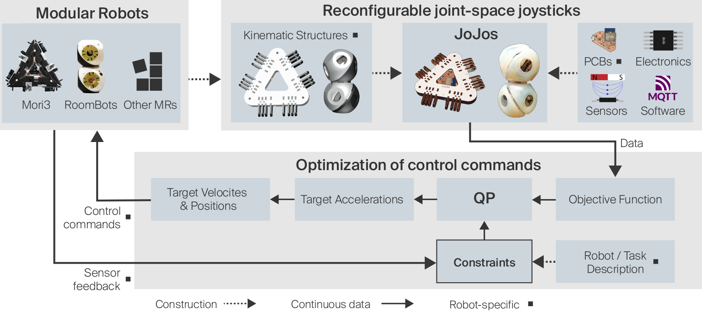

# Optimized User-Guided Motion Control of Modular Robots

This repository contains the code of controllers used in the experiments presented in our work on user-guided motion control of modular robots.

In this work we propose a physical and computational platform for user guided control of self-reconfigurable modular robots. This platform consists of an optimization scheme for online processing of user commands, which blocks robot actions that would violate system or environment constraints. The second component consists of Joint-space Joysticks (JoJos), which match the robot’s morphology, enabling the user to control diverse and dynamically changing modular robot structures through direct physical interaction.



## Required packages

* [`mc_rtc`](https://jrl-umi3218.github.io/mc_rtc/tutorials/introduction/installation-guide.html)


## BibTeX

```
@inproceedings{abkh2025,
  author = {Anastasia Bolotnikova* and Kevin Holdcroft* and Henry Cerbone and Christoph Belke and Auke Ijspeert and Jamie Paik},
  title = {Optimized User-Guided Motion Control of Modular Robots},
  note = {*these authors contributed equally to this work},
  year = {2025}
}
